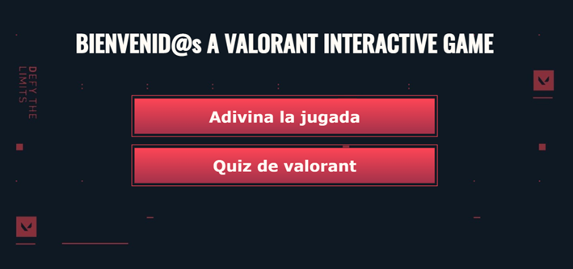
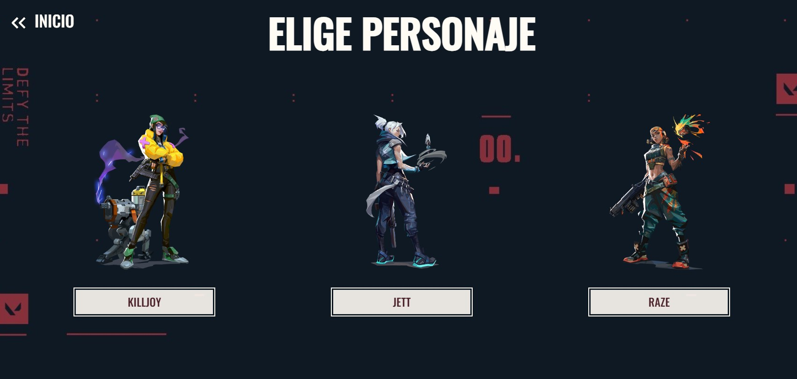
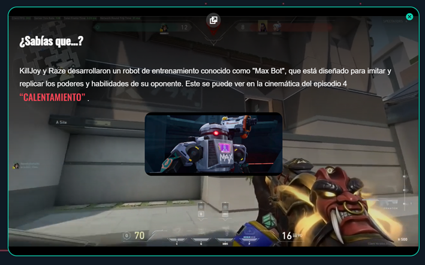

# 1. My Interactive Game Valorant

Se trata de una aplicación multimedia de video interactivo en el que se puede visualizar e interactuar con diferentes videos de la tematica del videojuego [Valorant](https://playvalorant.com/es-es/). Se contara con un modo de video para visualizar una jugada y diferentes preguntas relacionadas con esta y un quiz con diferentes preguntas sobre cultura general del videojuego.

El proyecto se ha generado con la versión 14.2.5 de [Angular CLI](https://github.com/angular/angular-cli).

## 1.1. Development server

Ejecutar el comando `ng serve` o `npm run` para iniciar la aplicación. La aplicación estará disponible en la dirección `http://localhost:4200/`. 

## Imagenes de la aplicación

